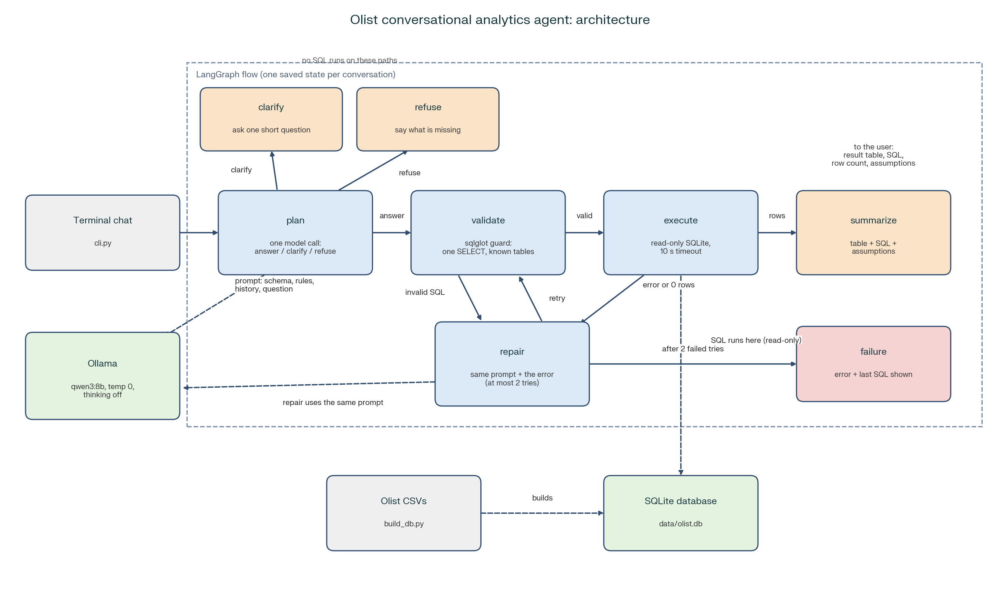

# Design

## The problem and the approach

Leadership wants to ask questions like "Which categories have the worst reviews?" without waiting for an analyst. The agent has to work from a real, slightly messy dataset (about 100K Olist orders over eight related tables), run entirely locally on a 16 GB laptop, and never invent a number.

My approach is deliberately plain: a local 8B model turns each question into one SQL query, a guard checks the query, SQLite runs it, and the answer is the result table plus the SQL that made it. The model never types the numbers that you see. That is what makes every figure traceable.

## Architecture

A turn works like this:

1. **Plan.** One model call reads the schema, the recent conversation, and the question. It returns JSON with an action (`answer`, `clarify`, or `refuse`) and, for `answer`, the SQL and the assumptions it made.
2. **Validate.** `sqlglot` parses the SQL. Only a single `SELECT` (or `WITH ... SELECT`) over known tables is allowed, and `LIMIT 200` is added if it's missing.
3. **Execute.** The query runs on a read-only SQLite connection with a 10-second timeout.
4. **Repair.** If validation fails, SQLite errors, or the query returns no rows, the same prompt is sent again with the failed SQL and the problem appended. After two tries the agent stops and reports the error and the SQL.
5. **Answer.** The result table, the SQL, the row count, and the assumptions used are shown.

## Decisions and the reasons for them

**Model and runtime:** Qwen3 8B through Ollama. It follows JSON instructions well and fits in memory next to everything else. Thinking mode is turned off, because hidden reasoning trace on CPU would add minutes to every answer.

**SQLite:** The data is small, SQLite ships with Python, and it needs no setup for the reviewers.

**One model call per turn:** My first version used separate calls for routing, SQL generation, and summarizing. On CPU, so one question cost around 220 seconds. Merging routing and SQL into a single `plan` call, lets Ollama reuse its cache. The same question now takes about 15 seconds after the first one.

**Why LangGraph:** I use it as a state machine: named steps, a conditional repair loop, and per-conversation state that persists between turns.

**Follow-ups use structured state.** After each successful query, the agent stores its SQL, metric, grouping, filters, and period. The plan prompt receives that plus the last three question-and-answer pairs. The stored query is updated only after a query succeeds, so a failed attempt can't poison the next turn.

**Clarify and refuse:** The model chooses among three actions. It asks one short question when at least two readings are equally plausible. It refuses when the data lacks the metric, the period is outside the data, or the input isn't a question at all.

**Number integrity:** By default, the agent doesn't ask the model to describe the results. It prints the table and the SQL. An optional narration mode exists, and it drops any sentence containing a number that isn't in the returned rows.

## Evaluation

The set has 23 questions: 8 aggregations, 4 multi-turn chains, 4 ambiguous requests, 5 requests that should be refused, and 2 data traps (join fan-out and customer identity). Answers are scored by comparing result sets to hand-written reference SQL; clarify and refuse cases are scored on the action chosen. Multi-turn cases with open-ended answers check the generated SQL for required terms instead.

| Run | Score | Held out | Time |
|---|---|---|---|
| Baseline, three model calls per turn | 17/22 | 4/5 | 1,251 s |
| Final Run | 19/23 | 5/5 | 759 s |

## Limitations and next steps

8B model can still pick the wrong reading of a vague question; the first answer after loading is slow on CPU; only the 22 core columns the schema exposes can be queried; With more time I would add the review view, write more unseen questions, and add a macOS/Linux launcher.

## How I used AI tools, and time spent

I used AI assistants to generate most of the code. I ran every test, evaluation and made the design choices myself. Time spent:  6 hours over 2 days.